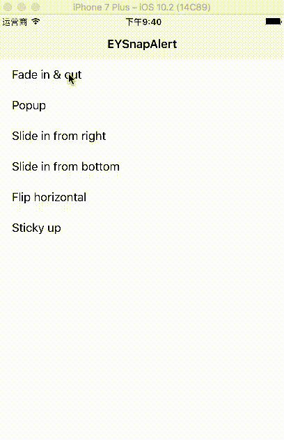

# EYSnapAlert

A simple alert box designed for iOS, with simple API. 

[](http://cocoadocs.org/docsets/EYSnapAlert/)
[](http://opensource.org/licenses/MIT)

  

-----

# Installation

## Pod
```ruby
pod 'EYSnapAlert'
```

## Manually

Drag 'EYSnapAlert.swift' to your project

# Usage

### Show an alert with default values

Show a alert with a single line

```swift
// Show alert with default settings
EYSnapAlert.show(message: "世界，你好")
```

### Show an alert with user specific parameters

```swift
// Show alert with fully customized setttings
EYSnapAlert.show(message: String(format: "你好，世界, [Style: %@]", cell.textLabel!.text!),
                 backgroundColor: UIColor.black,
                 textSize: 12,
                 textColor: UIColor.white,
                 duration: 3,
                 animationTime: 0.2,
                 cornerRadius: 5,
                 style: styles[indexPath.row].style,
                    onTap: { (alert) in
                    alert.hide()
                    print("Alert is tap...")
                 },
                 onDimissed: {() in
                    print("Alert was dismissed")
                 })
```

For more detail, please refer to the Example project.
